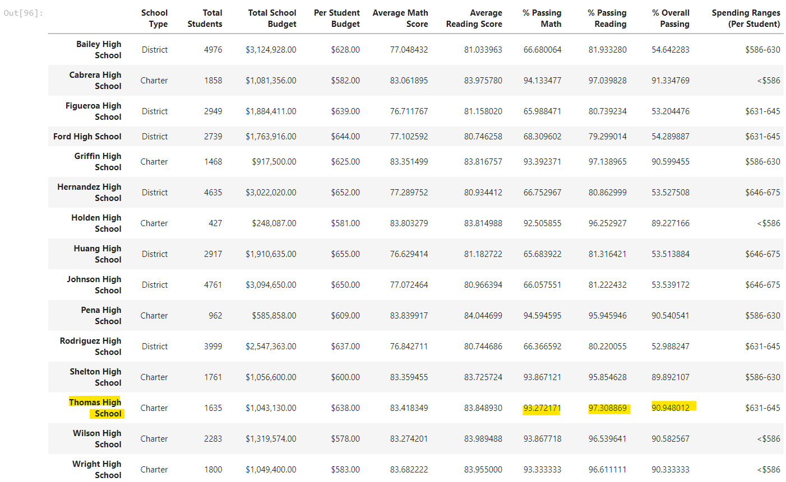
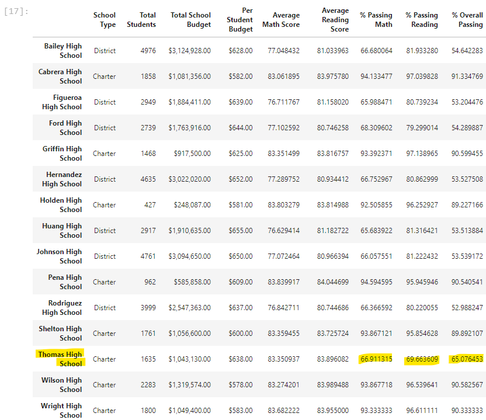
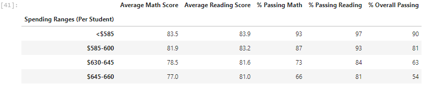
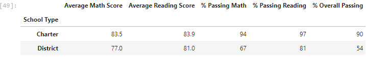
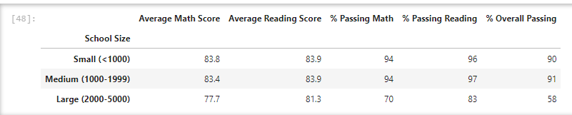

# School_District_Analysis

## Overview of the School District Analysis

The school board has notified Maria and her supervisor that the students_complete.csv file shows evidence of academic dishonesty; specifically, reading and math grades for Thomas High School ninth graders appear to have been altered. Although the school board does not know the full extent of the academic dishonesty, they want to uphold state-testing standards and have turned to Maria for help. Maria would like to see the math and reading scores replaced for Thomas High School with NaNs (Not a Number) to keep the rest of the data intact.  Additionally, school district analysis will need to be done again to the new data set with Thomas High School removed.

## Tools Used
* Anaconda version 2.1.1
* Jupyter-Notebook version 6.4.5
* Jupyter Lab version 3.3.3
* Python version 3.7.7
* Pandas
* Numpy

## Results

* How is the district summary affected?

    District numbers are not greatly affected by the removal of Thomas High School, original numbers 
    had total students of 39,170.  Having removed the 461 9th graders from Thomas High School kept 
    the averages fairly stable.

* How is the school summary affected?

    School summary is extremely affected, based on the total calculations viewed in image one below 
    against what the data revealss after the 9th grade removals from the overall Thomas High School 
    population in image two.

There was a significant drop in the percent of passing in Math,Reading and Overall. Overall, it went from 90.6 to 65.0.  You can see the academic dishonesty blatantly below.

### Original Data

### Updated Data with 9th Grade Removed

* How does replacing the ninth graders’ math and reading scores affect Thomas High School’s performance relative to the other schools?

    By replacing the math and reading scores affects Thomas High School's performance by changing the overall ranking from being in the top five to the bottom five.  

* How does replacing the ninth-grade scores affect the following:
    * Math and reading scores by grade
        Math and reading scores were not greatly affected for the district, but did impact the 
        school.
    * Scores by school spending
        Not a significant change.
    * Scores by school size
        Not a significant change.
    * Scores by school type
        Not significant change.

## Summary
1. Significant drop in overall passing rate for Thomas High School from 91% to 65%

2. Thomas High School ranking dropped from 2nd to 15th in overall ranking.

3. School Spending is inversely related to overall passing scores, which means more money spent does not impact test scores.

4. Type of school points to charter schools with smaller populations does do better with test scores overall as seen below.

School Type

Size of School
